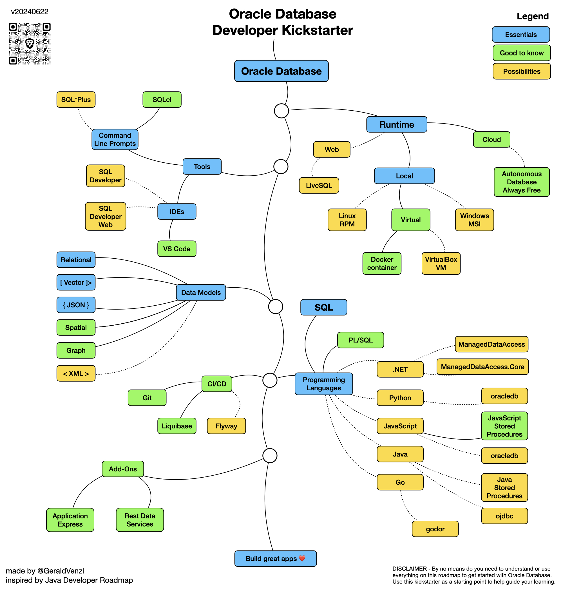

# Oracle Learning Roadmaps
This repository contains learning roadmaps for [Oracle Database](https://www.oracle.com/database/) technologies.

These Roadmaps were inspired by the [Java Developer Roadmap](https://github.com/devoxx/JavaRoadmap).

# Disclaimer
You do not need to understand or use everything illustrated in these roadmaps. They are here as a starting point to help guide your learning.

# Contributing
See the [Contribution Guide](CONTRIBUTING.md).

# Oracle Database Developer Kickstarter

